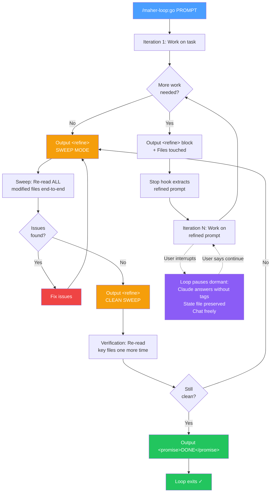

# Maher Loop Plugin

Iterative AI loop with **prompt refinement**, **built-in sweep protocol**, and **two-pass verification** for Claude Code. An evolution of the Ralph Wiggum technique where the prompt evolves each iteration and quality sweeps are built in.

## Ralph vs Maher

| Feature | Ralph Loop | Maher Loop |
|---------|-----------|------------|
| Prompt between iterations | Same every time | Refined each iteration |
| Completed work tracking | Via file changes only | Removed from prompt |
| Discovery incorporation | Implicit (file state) | Explicit (in refined prompt) |
| Convergence speed | Linear | Accelerating (prompt sharpens) |
| File tracking | No | Yes (`Files touched:` in every refine) |
| Quality sweeps | No (must launch separately) | Built-in (sweep + verification) |
| Review before completion | No | Yes (two consecutive clean passes required) |
| Concurrent loops | No | Yes (ID-based state files, session isolation) |
| Shell-safe prompts | No (parentheses break it) | Yes (heredoc input, parens/quotes safe) |
| Interrupt handling | Hijacks every subsequent turn | Pauses dormant, resumes on demand |

## How It Works



## Installation

```bash
/plugin marketplace add Maherr/maher-plugins
/plugin install maher-loop@maher-plugins
```

## Quick Start

```bash
/maher-loop:go Build a REST API for todos with CRUD, validation, and tests
```

Claude will:
1. Work on the task, creating tasks for complex work (3+ steps)
2. Output a `<refine>` block with an improved prompt (including `Files touched:`)
3. Stop hook extracts the refinement
4. Next iteration receives the sharpened prompt
5. When done, enters **SWEEP MODE** — re-reads all modified files end-to-end
6. After clean sweep, enters **verification pass** (second clean check)
7. After two consecutive clean passes, outputs completion promise
8. Loop exits

Default settings: `--completion-promise DONE --max-iterations 99`

## How Refinement Works

At the end of each iteration, Claude outputs:

```
<refine>
Improved prompt with:
- Completed items removed
- New discoveries added
- Remaining tasks sharpened
- Strategy adjusted based on this iteration
Files touched: [list of files modified this iteration]
</refine>
```

The stop hook extracts this block and updates the state file. If no `<refine>` block is output, the same prompt repeats (Ralph behavior).

## Built-in Sweep Protocol

When Claude believes the task is complete, it enters a multi-phase end sequence instead of immediately exiting:

### Phase 1: Sweep Mode
Claude re-reads **every modified file end-to-end** (not just targeted greps). Cross-checks numbers, references, and data between files. Looks for stale data, duplicate sections, arithmetic errors, and broken cross-references. The `Files touched:` list from refine blocks tells the sweep exactly what to check.

### Phase 2: Clean Sweep
If the sweep found zero issues, Claude outputs a `CLEAN SWEEP` refine to trigger the verification pass.

### Phase 3: Verification Pass
One final re-read of key output files to confirm that any fixes made during sweep didn't introduce new issues. Only after this second consecutive clean pass can Claude output `<promise>DONE</promise>`.

If issues are found at any phase, Claude fixes them and returns to Sweep Mode. This creates a convergence loop that runs until the output is genuinely clean.

**Why this matters:** In practice, review iterations that only check what you think to look for miss issues that full file re-reads catch (stale data, duplicate sections, inconsistent numbers between files). The sweep protocol was added after observing that a separate Ralph Loop sweep consistently found 5-10 additional issues after Maher Loop's original review mode declared "done."

## Smart Guidance

The loop instructions include conditional guidance that triggers when appropriate:

| Guidance | When it triggers |
|----------|-----------------|
| **Task tracking** | 3+ distinct steps — uses TaskCreate/TaskUpdate for progress visibility |
| **Parallel agents** | Complex research, debugging, or when stuck — spawns Agent tool for multi-angle investigation |
| **Foreground agents only** | Always — background agents may not complete before the stop hook fires |
| **Sequential API calls** | Rate-limited external APIs (Consensus, web search) — avoids wasted retries |

## Concurrent Loops

Multiple loops can run simultaneously in different terminals. Each loop gets a unique 8-character hex ID:

```
Terminal A: /maher-loop:go Build the API          → Loop ID: a3f8b2c1
Terminal B: /maher-loop:go Write the docs          → Loop ID: 7e2d4f09
```

Session isolation ensures each terminal's stop hook only processes its own loop. Isolation uses lazy claiming — the first hook invocation writes the session ID to the state file.

## Shell-Safe Prompts

Prompts are passed via heredoc, so parentheses, quotes, and other shell metacharacters work without escaping:

```bash
/maher-loop:go Create 3 files: 1) config.json, 2) dashboard.md that doesn't repeat data, 3) report.md
```

## Interrupt-Safe Pausing

You can ask off-topic questions mid-loop without cancelling it or hijacking the conversation. When Claude's response contains no `<refine>` or `<promise>` tag, the stop hook exits cleanly instead of forcing another iteration. The loop stays active but dormant — its state file is preserved.

**Example flow:**

```
You: /maher-loop:go Research competing cache libraries and recommend one --max-iterations 10
Claude: [researches, outputs <refine> SWEEP MODE]

You: Wait, what's the difference between LRU and LFU eviction?
Claude: [answers normally, no <refine> tag]

You: Interesting. What about ARC?
Claude: [answers normally, no <refine> tag — still no hook firing]

You: OK, continue the loop.
Claude: [outputs <refine> CLEAN SWEEP — loop resumes from where it paused]
Claude: [verification pass]
Claude: [<promise>DONE</promise>]
```

**How it works:** The stop hook checks if Claude's last output contains a `<refine>` or `<promise>` tag. If neither is present, the hook exits with code 0 (allowing the turn to end normally) without blocking. The state file stays intact, so the loop resumes the moment Claude outputs a new refine or promise.

**Why it matters:** Previously (v2.0.x and earlier), the "Ralph fallback" would re-feed the current prompt whenever no refine was found, which hijacked every user interrupt and made off-topic questions trigger a loop re-run. v2.1.0 removes the fallback in favor of clean pausing.

**To fully cancel the loop instead of pausing**, use `/maher-loop:cancel-maher`.

## Commands

- `/maher-loop:go <prompt> [--max-iterations N] [--completion-promise TEXT]` - Start loop
- `/maher-loop:cancel-maher` - Cancel active loop(s)
- `/maher-loop:help` - Show help

## Files

Each loop creates ID-based files in `.claude/`:

| File | Purpose |
|------|---------|
| `maher-loop-{ID}.local.md` | Active state + current prompt (updated each iteration) |
| `maher-loop-{ID}-original.local.md` | Original prompt (never modified) |
| `maher-loop-{ID}-history.local.md` | Log of every prompt refinement |

## Architecture

```
Claude works -> tries to exit -> stop hook fires (0.1s flush delay) -> checks for:
  1. Session match (lazy claiming / reject other sessions)
  2. <promise> tag -> stop loop (preferred over max-iterations)
  3. Max iterations -> stop loop (fallback)
  4. <refine> tag -> update prompt, log to history
  5. Otherwise -> block exit, feed current prompt back
```

## Safety

- Default `--max-iterations 99` as a safety net
- Default `--completion-promise DONE` requires exact match in `<promise>` tags
- Session-isolated via lazy claiming — other terminals are never hijacked
- Concurrent loops supported — each gets its own ID-based state files
- Shell-safe input via heredoc — no metacharacter injection
- History file preserves the full refinement trajectory for debugging
- Race condition retry limit (5 retries) prevents infinite retry loops
- 0.1s transcript flush delay prevents stale refine extraction
- Compatible with Claude Code's no-flicker mode
